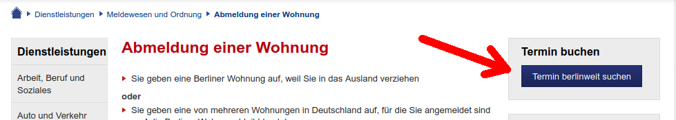
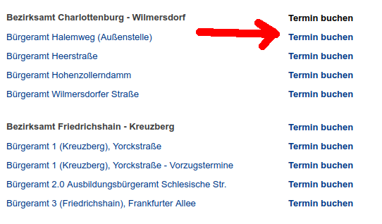

# Berlin Bürgeramt Appointment Bot
This repository was once forked from https://github.com/Sinnaj94/buergeramt-scan. So big thanks for the initial work!  
But now it got completely reworked to get the date of the free appointments and moreover to act as a telegram bot.  

## What it's not
This script is not and will not be able to unattendedly register appointments for you. It only shows you the days that have free appointments and it's up to you to visit the url and reserve an appointment for you.  
Altough it would be technically possible to automatically reserve an appointment, but in my opinion it would be antisocial to do so. And also the side effects would be that people reserve multiple appointments which they do not use. So don't expect the bot to do this ever.

## Demo
You can use this live bot by visiting https://t.me/buergeramtstermine_bot

## Usage
You can interact with the bot using the commands `/hilfe` , `/termin` or `/abbruch`  
So if you want to find days with free appointments, go to https://service.berlin.de/dienstleistungen/ choose your Dienstleistung and scroll to the button "Termin berlinweit suchen" and copy it's url to the clipboard (right click on the button).  
This will look like this  
```
https://service.berlin.de/terminvereinbarung/termin/tag.php?...
```
The button will look like this for searching all citizen's offices  


or for a single citizen's office



Then you just need to send `/termin` to the bot and append the URL you just copied

## Building
Just install all requirements with
```
pip install -r requirements.txt
```
## Running
Edit the file config.py and insert your telegram bot token.  
Then run the bot with
```
python bot.py
```
## Debugging
Debugging is made easy by using https://code.visualstudio.com/ or (my recommendation) by using https://vscodium.com/

## Dockerizing
The bot can also be run inside a docker container. Here's how to.  
Create the container image
```
docker build -t buergeramtstermine_bot:latest .
```
Run the container
```
docker run -d <container id>
```
